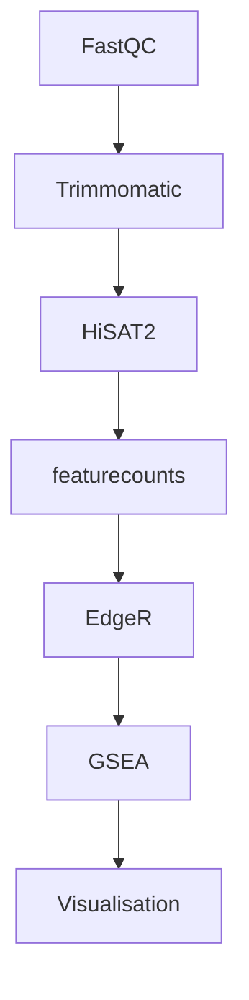

# Elf3-MT
# **INTERACTIONS OF ELF3 AND DNA METHYL TRANSFERASES IN MESENCHYMAL EPITHELIAL TRANSITION**

## Aim of the study
This Project mainly aims to investigate the impact of Elf3 on DNA methylation and DNA methyltransferases (Dnmt1, Dnmt3b, Uhrf1) using an integrated approach, including gene modulation and bioinformatics, and to contribute to our epigenetic perspective in the regulation of MET with in vitro experiments to be performed on the NMuMG cell line.

## Data Collection
The experiments utilized the Normal Murine Mammary Gland cell line (NMuMG), procured from ATCC (ATCC® CRL-1636) in 2017. This cell line is a widely recognized and frequently employed model for studying EMT and MET (Miettinen et al., 1994). This model is favored due to its distinct gene signature alterations manifested in observable morphological changes. Upon exposure to TGFβ, these cells undergo EMT labeled as TGFβ3, characterized by the downregulation of Cdh1, the rearrangement of cortical actin to stress fibers, and the upregulation of mesenchymal genes such as N-cadherin and Vimentin. Notably, upon removal of TGFβ from the culture medium, these cells transition back to the epithelial state via MET within 72 hours labeled as PT72 (post-transition) (Alotaibi et al., 2015).

# 

## RNA-Seq Analysis 

As shown in the figure analysis starts with quality control and FastQC tool is used. Then adaptor and quality trimming is performed with trimmomatic. To align sequences to genome HISAT2 tool is used. Quantification performed with featurecounts and differentially expressed genes defined with EdgeR. Gene set enrichment analysis performed with fgsea R package. Visualisation and statistic analysis performed in R.

All data collection and processing operations were conducted on an Apple MacBook Air, 8 GB RAM computer with MacOS Monterey 12.6.3 operating system, and IBG HPC environments have been used for data collection in this study.
